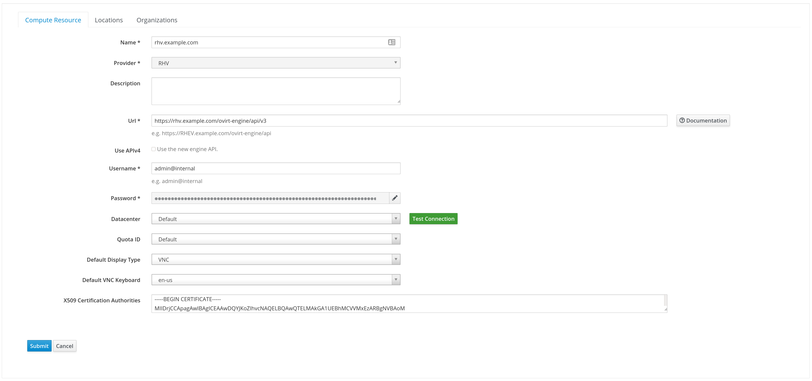
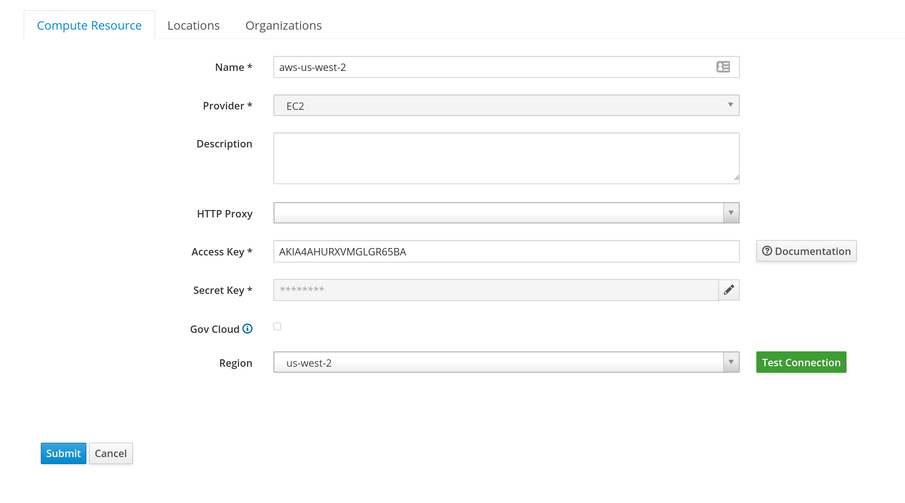
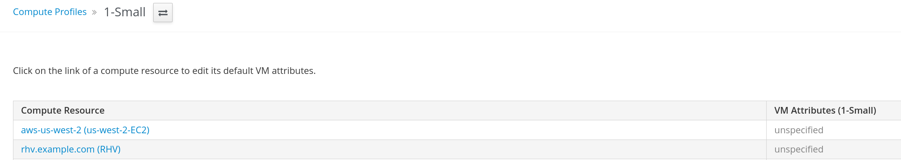
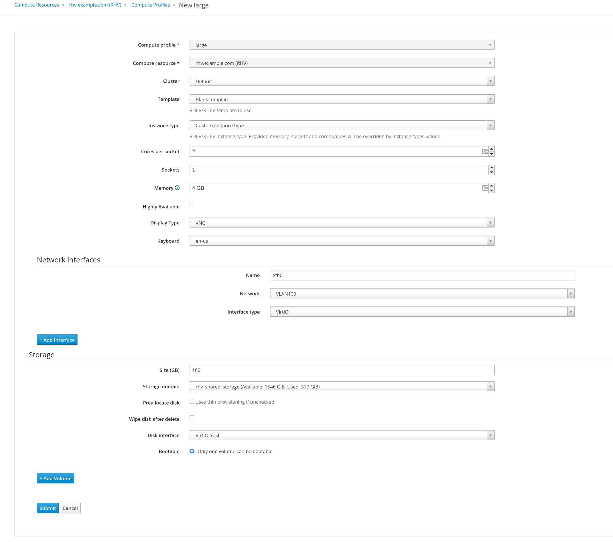

# PART 1: Using Ansible to Provision from Satellite
Satellite has an excellent tool for provisioning machines, both from a physical and virtual standpoint.  However sometimes a need may exist to create many machines (or just one) in a more automated fashion.


## Satellite Prep
Configuring Repository Syncs, Lifecycle Environments, and Content Views are core concepts of Satellite, so it is assumed that those are already set up for this process.

There are however a few things that require additional configuration:
- Compute Resources
- Compute Profiles
- Environmental Parameters


## Finding Specific Names for Repos, Proxies, Content Views and Lifecycle Environments, the Quick Way
There are numerous ways to find things in Satellite, however one of the quickest is the `hammer` command.  Some useful commands to considering during this process are as follows:

`hammer repository list` # lists all of the repos and their names (necessary for kickstarts)

`hammer proxy list` # lists all of the satellite smart-proxies (including capsules for the remote sites)

`hammer content-view list` # lists all of the content views available

`hammer lifecycle-environment list` # lists all of the lifecycle environments

`hammer --help` # when you don't know exactly what you're looking for

## Compute Resources
Compute Resources are analagous to your virtualization manager, and can include Red Hat Virtualization, Red Hat OpenStack, VMWare, Hyper-V, Google, AWS, Azure, and Libvirt.

To configure these through the Satellite UI, navigate to **Infrastructure-->Compute Resources**, then select the appropriate provider and fill out the fields.  

While each of the hypervisor/provider types vary slightly in how you configure them, the fields are pretty self-explanatory.  

Here is an example of what the Red Hat Virtualization Manager configuration looks like for our environment:



Here is an example of what the AWS region configuration looks like:



**You will need to repeat this process for each unique manager/datacenter combo for hypervisors, and for each region for cloud providers**

A good approach for this would be to adopt a sensical naming architecture (even if unnessary at first) such as DC1-VirtManager1.example.com or Azure-West1-Tenant1.

## Compute Profiles
Compute profiles are analagous to what most cloud providers refer to as instance types, consisting of standardized CPU/RAM/Disk combinations.

By default, Satellite ships with 3 flavors (Small, Medium, Large).  Since different providers have different configuration options, you will notice that each Compute Profile will have a configuration section for each Compute Resource that you have configured:



To configure these through the Satellite UI, navigate to **Infrastructure-->Compute Profiles** and create the appropriate profiles that your organization desires.  
*Note: remember the purpose of automation is to handle MOST of your cases, not necessarily all of them. Keep the number of compute profiles you have to match your most common use cases.*

**For the first few exercises we are going to be focused at on-premise environment-type providers (RHV, VMware).**

**There are addtional steps required for cloud providers that will be covered at a later point.**

Here is an example of what a large compute profile for our RHV instance might look like:



A couple of important items:
- 4GB of RAM is typically required for Kickstarts (when using an HTTP based repo)
- We are defining and attaching a network interface to the VM
- We are creating and attaching a blank disk to the VM and making it bootable

## Environmental Parameters
Satellite has the ability to take in Parameters at the Host, Location, and Organizational levels that can be reference during deployment to enable certain configuration templates.  While we won't cover in much detail exactly how those work, we will cover a few items of interest that we'll want to managing our machines, namely a service account and an ssh-key for that service account.

You can configure service-accounts and ssh-keys at the Host, Location, or Organization level for granular control, we will be doing it at the Organizational level for ease of use (since it will be inherited by all machines that are members of that Organization).

To configure this go to **Administer-->Organizations**.  Then click on **Edit** for the Organization that you wish to apply these ssh settings to.  Once in the Organization, clikc on the **Parameters** link in the bottom left.

Now we will add three parameters:

| Name                           | Type                  | Value                           | 
| ------                         | --------------------  | -----------                     |
| remote_execution_create_user   | string                | yes                             |
| remote_execution_ssh_user      | string                | service_account                 |       
| remote_execution_ssh_keys      | array                 | ["ssh-public key value 1"]      |

\*Note: the remote_execution_keys value should be a comma-delimtied array of public ssh keys.

These parameters will be inherited as variables into provisioning templates when our machine is built.

The result of which will be that a new user 'service_account' will be created with access from the associated public ssh keys.

The benefit of this is that we can now have access to all of our provisioned machines via a single credential, for use in Tower later on.


## Enter The Red Hat Satellite collection
Red Hat has several certified collections in Ansible that are both vetted and officially supported by Red Hat.  By utilizing Ansible modules for Satellate we can take an automated approach towards accessing the functions provided by it.

## Installing the Collection
By default these collections are not distributed with Ansible, so we will need to install them.

First we will need to update our ansible.cfg file with appropriate tokens for access to the Red Hat Certified collecitons.

Go to <https://cloud.redhat.com> and navigate to **Automation Hub**.  From there click the 'satellite' colleciton.  In the top right there is a button that says **Get API token**, click that.  Click **Load token** then copy the long string provided.

Now, edit your /etc/ansible.cfg file, so that it looks similar:
```
[defaults]
stdout_callback = yaml

[galaxy]

server_list = automation_hub, release_galaxy

[galaxy_server.automation_hub]
url=https://cloud.redhat.com/api/automation-hub/
auth_url=https://sso.redhat.com/auth/realms/redhat-external/protocol/openid-connect/token
token=(reallylongredhattoken)

[galaxy_server.release_galaxy]
url=https://galaxy.ansible.com/
token=(shortergalazytoken)

```

Now to install our collection.

`ansible-galaxy collection install redhat.satellite -p ./collections`

Alternately you can install them from the tarball on the page provided or by using the ansible-collection-redhat-satellite yum/dnf package.

Documentation for all of the Red Hat Satellite modules can be found here:
<https://cloud.redhat.com/ansible/automation-hub/redhat/satellite/docs>

For the module to work properly there are a few Python dependencies that must be filled, namely:
- PyYAML
- apypie
- ipaddress for the subnet module on Python 2.7
- rpm for the RPM support in the katello_upload module
- debian for the DEB support in the katello_upload module

These can be installed via pip:
`sudo pip3 install apypie`

**(this should be performed on all Ansible Tower application nodes, for future use)**


## Using the Modules
The main module of interest here is the **host** module.

This module will allow for the creation/deletion/modification of hosts.

A basic play for creating a server might look like this:

```
  - name: "Create a host"
    host:
      username: "satellite_admin"
      password: "satellite_admin_pw"
      server_url: "https://satellite.example.com"
      name: "new-server.example.com"
      compute_resource: "virtualization-manager.example.com"
      architecture: "x86_64"
      build: true
      domain: "example.com"
      compute_profile: "Large"
      organization: "Satellite Org"
      location: "Satellite Location"
      mac: e0:d5:5e:2b:08:90
      ip: 192.168.100.239
      root_pass: "new-servers-root-pw"
      subnet: "192.168.100.0/24"
      provision_method: "build"
      lifecycle_environment: "Production"
      content_view: "Satellite Content View"
      operatingsystem: "RHEL Server 7.8"
      ptable: "Kickstart default"
      content_source: "satellite.example.com"
      pxe_loader: "PXELinux BIOS"
      kickstart_repository: "Red Hat Enterprise Linux 7 Server Kickstart x86_64 7.8"
      validate_certs: no
        parameters:
        - name: subscription_manager
          value: yes
        - name: subscription_manager_certpkg_url
          value: https://satellite.example.com/pub/katello-ca-consumer-latest.noarch.rpm
        - name: redhat_install_host_tools
          value: yes
        - name: redhat_install_agent
          value: yes
        - name: subscription_manager_org
          value: My_Org
        - name: activation_key
          value: My-Activation-Key
        - name: http-proxy
          value: proxy.example.com
        - name: http-proxy-port
          value: 3128
        - name: http-proxy-user 
          value: sat_squid_user
        - name: http-proxy-password
          value: my-proxy-password
      state: present

```
**If unsure of names/values for certain parameters, reference the hammer commands listed earlier.**

After running this playbook we will see that a couple of things have been accomplished:
- A host was created in Satellite
- All of the appropriate information (Org, Location, Lifecycle Environment, Content View, etc) has been assigned to that host
- A host was created in our virtualization environment, but not turned on

You may have also noticed that we have also entered a bevy of host level parameters.  These are parameters that may be more specific to the host, but the gist of what the ones above are doing is:
- Installing the Satellite certificates package (which also updates RHSM)
- Utilizing subscription manager
- Installing the katello host tools and agent
- Specifying an organization (yes this seems a bit redundant, but this param is required for the finish template to properly activate the machine)
- Specifying an activation key
- Utilizing a proxy, as well as setting a port, username and password

## Turning on the Virtual Machine
Because you're not trying to supplement your automation with manual intervention...

Good news, we can accomplish this by utilizing the host\_power module.

```
  - name: "Start up host"
    host_power:
      username: "satellite_admin"
      password: "satellite_admin_pw"
      server_url: "https://satellite.example.com/"
      name: "new-server.example.com"
      state: on
      validate_certs: no
```

## Go Find a Tasty Beverage of Choice
Once the machine starts up it will automatically start the PXE booting process, and the the installation of the requested software.  Nicely done!  Part two will cover how to take our work and make it more Ansible Tower appropriate.
