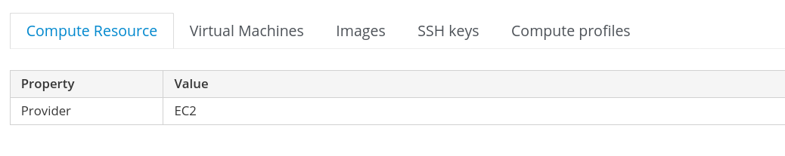

# Part 3, Tower Part II: Adding a cloud Compute Resource (and making it work)

Thus far, we've taken you from running a single playbook, to running a single playbook in Tower, with variables.  Now, we're going to adapt the work we've done and make it so that a user/consumer can deploy in either environment, from the same Tower survey.

**Note: we will be refactoring some of our previous work in this section as approaching a multi-cloud environment present new and exciting opportunities for taking a different approach (AKA the previous won't work for a myriad of reasons, so we're adapting)**

## Compute Resources
Now that we're in the middle, let's go back to the beginning...

First, to be able to provision to a cloud provider from Satellite, we'll need to configure that cloud provider as a Compute Resource.

The steps will be very similar to the first time:

In the Satellite UI Navigate to **Infrastructure-->Compute Resources** and click **Create Compute Resource**.  In this instance we will choose **EC2** as the Provider.

You will notice that the options are a bit different than they were when we created the RHV/VMware resource.  Most of the fields are pretty self-explanitory, the most important field is the **Region** field.  As you may have guessed, you'll have to create a Compute Resource for each region within AWS.  This is a bit of a headache, but is more a result of the way that AWS has designed their infrastructure to be resiliant and regionalized at all levels (vs a poor UI design).

A completed Compute Resouce configuration may looks similar to this:


Once the Compute Resource has been created you should be presented with a screen similar to this:


Now that we have a completed Compute Resource, you may notice that we have the following tabs available: **Compute Resource, Virtual Machines, Images, SSH Keys, & Compute Profiles.**

For the moment we are just concerned about **Images**, since we can't deploy to the cloud without some sort of image.  

In the AWS world, you will need an AMI (Amazon Machine Image).  There are many ways to find an AMI, whether through the command line or market place.  If you aren't sure where to start for, a good place might be [here](https://lmgtfy.com/?q=how+to+find+AMI+id+in+aws).

Now that you have the AMI that you'd like to use for this Compute Resource, click the Images tab, then Create Image.

Fill in the appropriate information, then click submit.

**Note: The Operating System field is populated based on Operating Systems currently avaialble for provisioning within Satellite, if you don't have subscriptions, repos, sync schedules, content views, etc, this won't work, finish setting up Satellite first.**

Great now we have an image that we can deploy from in this region.  Let's move to the next step.


## SSH Keys
**Full disclosure: Satellite's approach to key management for cloud environments is...sub-optimal.**

When you initially create a cloud Compute Resource, Satellite generates an SSH Key, associates it with that compute profile, then copies it to the appropriate cloud resource.  Satellite dyanmically generates a new foreman ssh key for **every** compute resource that you create. 

This is great for speed, however, if you're already working with this cloud, and you already have your SSH key created for managing instances, this quickly becomes problematic, both from a logging into the machine standpoint, as well as allowing Ansible Tower management of said machine.

To help simplify this process we will implement a couple of steps that help to streamline things:
1. Create a new service account that will be used by Satellite/Tower (on the new machines)
2. Copy an ssh-key to the new machines (as part of the bootstrapping process)

What this will do is create a common (non-root) account with a corresponding SSH key.  This enables us to:
1. Have a consistent method of managing machines via SSH keys across all providers, private and public
2. Allow for a user to use their own public key and account as a part of the build process.


Thankfully we can accomplish this pretty easily by adding a couple of parameters to an Organization in Satellite.

Part of the default provisioning templates in Satellite look for Remote Execution Parameters to be set.  If we set these parameters, they will be automatically injected during the build process.

There are three parameters that need to be set:
1. remote_execution_ssh_user (this is set as a string and the name of our service account)
2. remote_execution_create_user (this is set as a string to 'true')
3. remote_execution_ssh_keys (this is set as an array and has our ssh keys in the BASH array format, eg ['value1', 'value2'])

For our purposes we will define these at the Organization level (for maximum simplicity).

In Satellite, navigate to **Administer-->Organizations** then click **Edit** on the Organization you will be using (repeat steps if multiple Organizations)

Once in the 'Edit' context, go to **Parameters** and enter the following data (where service_account is the name of the service_account, and where pub key value is the text value for the ssh public key):

| Name                         | Type   | Value             | 
| ---------------------------- | ------ | ------------------|
| remote_execution_create_user | string | yes               |
| remote_execution_ssh_user    | string | service_account   |
| remote_execution_ssh_keys    | array  | ['pub key value'] |

Now that we have all of this set up, let's take a look at what an updated playbook might look like:

```
---truncated---

- name: "Create a host"
  host:
    username: "{{ satellite_user }}"
    password: "{{ satellite_pw }}"
    server_url: "https://satellite.example.com"
    name: "{{ requested_server_name }}"
    compute_resource: "{{ compute_resource }}"
    architecture: "x86_64"
    domain: "{{ domain }}"
    compute_profile: "{{ instance_type }}"
    organization: "{{ satellite_org }}"
    location: "{{ satellite_location }}"
    root_pass: "{{ new_server_root_pw }}"
    provision_method: "image"
    lifecycle_environment: "{{ lifecycle_env }}"
    content_view: "{{ content_view }}"
    operatingsystem: "{{ system_os }}"
    content_source: "satellite.example.com"
    kickstart_repository: "{{ kickstart_repo }}"
    parameters:
      - name: subscription_manager
        value: yes
      - name: subscription_manager_certpkg_url
        value: https://satellite.example.com/pub/katello-ca-consumer-latest.noarch.rpm
      - name: redhat_install_host_tools
        value: yes
      - name: redhat_install_agent
        value: yes
      - name: subscription_manager_org
        value: "{{ satellite_org }}"
      - name: activation_key
        value: "{{ activation_key }}"
      - name: http-proxy
        value: squid.labgear.io
      - name: http-proxy-port
        value: 3128
      - name: http-proxy-user 
        value: sat_squid_user
      - name: http-proxy-password
        value: "{{ sat_squid_user_password }}"
    state: present
  async: 1800
  poll: 0
  register: host_create

- name: "check deployment status"
  async_status:
    jid: "{{ host_create.ansible_job_id }}"
  register: job_status
  until: job_status.finished
  retries: 1000
  delay: 10

---truncated---
```
*Note, in the RedHat.Satellite Ansible collection 1.0, there is a bug where parameters will be set after the host creation, this causes finish templates to not appropriately render, so to accomodate those settings you will want to use other various modules to accomplish those means.  For tracking the bugzilla is [1855008](https://bugzilla.redhat.com/show_bug.cgi?id=1855008).*

As we look through the playbook, we will notice a few things are different:
- Certain arguments don't exist because they aren't applicable in a cloud environment
- Heavy use of host parameters
- The job being made asynchronous

## Missing arguments ##
Certain things aren't applicable or choosable in a cloud environment, like a specific IP or MAC address.  This should be somewhat self explanitory.

What may not be as clear is the fact that we don't define a subnet/network for our host.  The reason for this is that it is defined by the compute resource we are using.  (yes, if you wish to provide the ability to provision to multiple subnets, you will need to create a Compute Resource for each).

## Heavy use of host paramters ##
When we deploy using a kickstart, hosts are auto-registered and subscribed to Satellite.  However when we deploy in the cloud we don't have that option, so we can make use of host parameters to handle this for us in our finish template.  We won't be covering finish templates here, however a good place to get educated about them is in the docs, [here](https://access.redhat.com/documentation/en-us/red_hat_satellite/6.7/html/provisioning_guide/provisioning_cloud_instances_in_amazon_ec2#configuring_a_finish_template_for_an_amazon_web_service_ec2_environment).

## The job has been made asynchronous ##
With a kickstart job, Satellite is quickly able to determine the status and progress of the machine being deployed.  When we deploy to the cloud there are several steps that occur, and Satellite will not respond back from the Ansible job until they finish, which can potentially take 10+ minutes depending on the image and instance type.

To address this we make the call asynchronous, and then have a follow up task that checks the status of the previous task every 10 seconds, until it has successfuly completed.  This is namely to avoid running into a job timeout scenario.

## But what about logging in as a user?  Root SSH access isn't allowed by most cloud providers... ##
Talk about how to create a user and upload ssh key here.

## Ensuring flexibility ##
Put stuff here about the block statements.

## Let's get to provisioning! ###
Tie the provisioning process together.

