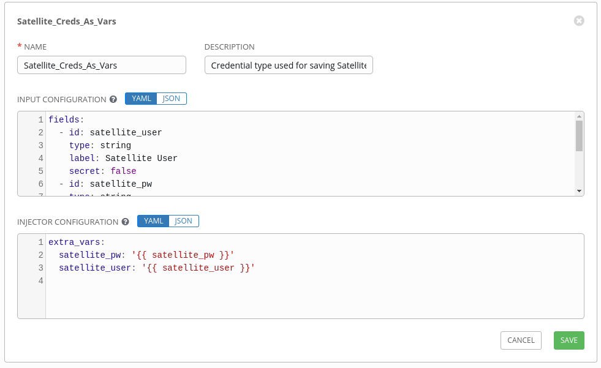
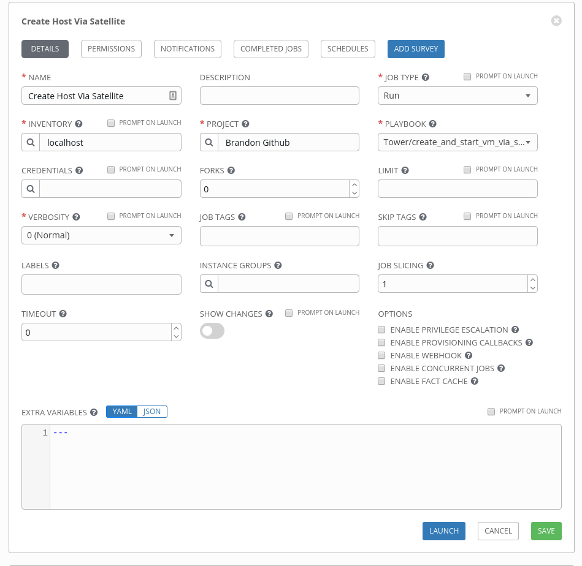
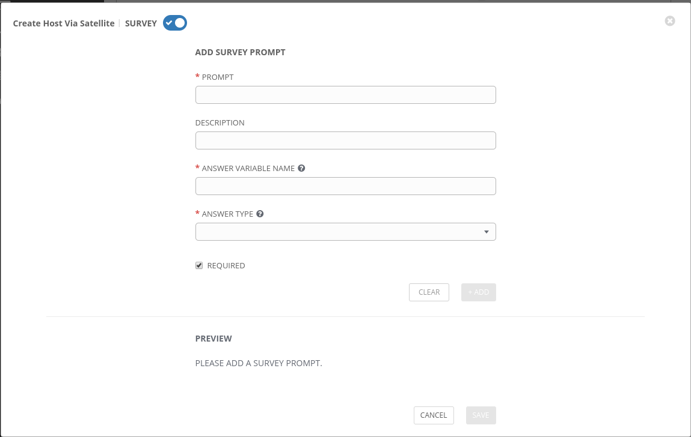

# PART 2: Using Tower
In our first section we set up Ansible to utilize Satellite's ability to create virtual machines.  That is great, but if that was where we stopped, we really just moved the work around a bit.  If we want to really step up our game here we need to get this work into Ansible Tower so that we can do things like auditing, sharing, variable replacement, and self-service.


## Variable Replacement
Our ultimate goal is that our customers/users will be able to self-serve and create their own virtual machines without having to write their own playbooks.  In order to enable that we are going to need to work on making our playbook more variable friendly.

```
  - name: "Create a host"
    foreman_host:
      username: "{{ satellite_user }}"
      password: "{{ satellite_pw }}"
      server_url: "https://satellite.example.com"
      name: "{{ requested_server_name }}"
      compute_resource: "{{ compute_resource }}"
      architecture: "x86_64"
      build: true
      domain: "{{ example.com }}"
      compute_profile: "{{ compute_profile }}"
      organization: "{{ satellite_org }}"
      location: "{{ satellite_location }}"
      mac: "{{ 56 | random_mac }}"
      ip: "{{ server_ip }}"
      root_pass: "{{ new-servers-root-pw }}"
      subnet: "{{ subnet }}"
      provision_method: "build"
      lifecycle_environment: "{{ lifecycle_env }}"
      content_view: "{{ content_view }}"
      operatingsystem: "{{ operating_system }}"
      ptable: "Kickstart default"
      content_source: "satellite.example.com"
      pxe_loader: "PXELinux BIOS"
      kickstart_repository: "{{ kickstart_repo }}"
      validate_certs: no
      state: present
```
There is a lot going on here (and we're just getting started), but the gist of it is that we have taken any of the information that can be set and given it a nice sensible variable name.  Ultimately these variable will be populated via a Survey in Ansible Tower.

## But there are things in that list I don't want users to enter/know!
Absolutely, let's address them now.

**Satellite Username/PW**

This can be handled by creating a custom credential-type in Tower that will store the Satellite Username/PW in an encrypted store, that can later be accessed as variables when that credential is associated to the Job Template.  The official documentation for Credential Types can be found here: <https://docs.ansible.com/ansible-tower/latest/html/userguide/credential_types.html#getting-started-with-credential-types>


To create a Custom Credential type in the Ansible Tower UI go to **Credential Types-->+**.

This will bring up a new screen that asks for a Name, Description, Input Configuration and Injector Configuration.

The input configuration takes the data you provide and makes it so that you can now create new credentials of this class.

For our Satellite Username and Password, we will fill it out as such:

**NAME:**

`Satellite_Creds_As_Vars`

**DESCRIPTION:**

`Credential type used for saving Satellite Credentials to be accessible as vars in a playbook`

**INPUT CONFIGURATION:**

```
fields:
  - id: satellite_user
    type: string
    label: Satellite User
    secret: false
  - id: satellite_pw
    type: string
    label: Satellite Password
    secret: true
required:
  - satellite_user
  - satellite_pw

```

This will make it so that when a user goes to create a new 'Satellite_Creds_As_Vars' credential they will be prompted for a Satellite Username and Password.  Both fields will be required and the Password field will be masked.


**INJECTOR CONFIGURATION:**

```
extra_vars:
  satellite_user: '{{ satellite_user }}'
  satellite_pw: '{{ satellite_pw }}'


```

This will make it so that the satellite_user and satellite_pw values will be accessible as extra_vars when our Job Template runs.


Your final Custom Credential Type should look something like this (note that the Input Configuration is truncated due to the Tower UI):



**Compute Resources**
  - Your user's may not know the name of your RHV-M or vCenter instance, this may be further complicated if you have multiple compute resources available.
  - The suggested approach here would be to offer the user a name they are familiar with in the Survey (like DC1), and in your playbook doing a dictionary lookup (against a dictionary you've already created that maps simple names to real values)

**Lifecycle Environments, Content Views, Content Sources, pxe_loader,kickstart repository**
  - The goal of keeping it simple for the user does make it more complicated for us on the backend, however the suggestion here would again be to do a dictionary lookup that maps values (against a dictionary you've created)

**Subnet's and IP's**
  - User's may not be familiar with subnet names/masks so the suggested approach would be to use common names and again use the dictionary mapping technique previously mentioned in conjunction with an IPAM solution.

## Shut up about dictionary mapping and show me
Sheesh, fine.

These can be imported as vars in any of the ways that is supported, but for the sake of simplicity we will do it in the vars section of our playbook.

```
---
- name: "Power on Host"
  hosts: all
  collections:
  - theforeman.foreman
  vars:
    compute_resources:
      DC1: virtualization-manager-1.example.com
      DC2: virtualization-manager-2.example.com
    lifecycle_envs:
      Prod: Production
      UAT: User_Acceptance_Test
      Dev: Development
    content_views:
      RHEL7: "Red Hat Enterprise Linux 7"
      RHEL8: "Red Hat Enterprise Linux 8"
    kickstart_repos:
      RHEL_7_7: "Red Hat Enterprise Linux 7 Server Kickstart x86_64 7.7"
      RHEL_7_8: "Red Hat Enterprise Linux 7 Server Kickstart x86_64 7.8"
      RHEL_8_0: "Red Hat Enterprise Linux 8 for x86_64 - BaseOS Kickstart 8.0"
    subnets:
      App1_subnet: "192.168.100.0/24"
      App2_subnet: "10.1.0.0/16"
      DMZ: "172.16.0.0/22"

---truncated---


```

## Okay, so now we have a dictionary, how do we access these values?
We map Survey response answers to keys in the dictionary, whose values correspond to what we actually need.

So now we can call these by doing the following:

```
---truncated---

  vars:
    requested_dc: DC1
    compute_resources:
    DC1: virtualization-manager-1.example.com
    DC2: virtualization-manager-2.example.com

---truncated---

  - name: "Lookup the Virtualization Manager for the DC"
    set_fact:
      compute_resource: "{{ item.value }}"
    loop: "{{ lookup('dict', compute_resources) }}"
    when: "'{{ requested_dc }}' in item.key"

  - name: "Create a host"
    foreman_host:
      username: "{{ satellite_admin }}"
      password: "{{ satellite_admin_pw }}"
      server_url: "https://satellite.example.com"
      name: "{{ requested_server_name }}
      compute_resource: "{{ compute_resource }}"

---truncated---


```
In the example above, assume the variable 'my_dc' gets choosen by the user from a list, where the options are DC1 and DC2 because they just know what Datacenter they want to deploy in.  When they choose D1, we will set a fact that does a lookup of DC1-->virtualization-manager-1.example.com, which will then get used in our playbook to create the VM.

**Please note that `requested_dc` is listed in the vars section above, but in the real scenario the var will be populated by the survey**


This is a single example, however this can be done for each of the situations where we need to get information from a customer/user but they might not know the exact resource name.  

## What about IP addresses?
Hopefully your organization uses some sort of IPAM that is programmable via an API (or better yet Ansible module).  In most cases this is typically something like InfoBlox or netbox.  In the instance of InfoBlox we would use the `nios_next_ip` module to retrieve the IP address and set it as a fact to later be used in the foreman_host module.

In our example we will use netbox:

```
---truncated---  
  - name: "Get next available IP in block"
    netbox_ip_address:
      netbox_url: http://192.168.100.5
      netbox_token: 7b0fa0b132379c782a58cd638e2413b3f4020eaf
      data:
        prefix: "{{ subnet }}"
        description: "{{ requested_server_name }}"
      state: new
    register: netbox_data
---truncated---
```

The result of this is that we will look up the subnet variable and ask netbox for the next available IP in that block and reserve it and add a note with the hostname.  Then we will store the output of the command into a variable called netbox_data.

Afterwords we can fill in the foreman_host block for the IP as follows:

```
---truncated---

  - name: "Create a host"
    foreman_host:
      username: "{{ satellite_user }}"
      password: "{{ satellite_pw }}"
      server_url: "https://192.168.100.10"
      name: "{{ requested_server_name }}"
      compute_resource: "{{ compute_resource }}"
      architecture: "x86_64"
      build: true
      domain: "{{ domain }}"
      compute_profile: "{{ instance_type }}"
      organization: "{{ satellite_org }}"
      location: "{{ satellite_location }}"
      mac: "{{ '56' | random_mac }}"
      ip: "{{ netbox_data.ip_address.address.split('/')[0] }}"
---truncated---
```

The reason for the split is because Netbox returns the IP address in the CIDR format, and Satellite just wants the dotted decimanl notation (Satellite discovers the mask from the Compute Profile which makes reference to the networks defined in Satellite).

## What about creating a DNS record?
Satellite can be used to automatically create DNS records, or DNS records can be created using one of the various DNS modules available from providers.  This will not be covered here as DNS providers vary widely.


## Making it available to consumers
What is the best kind of automation?  The kind you don't have to be involved in.  So, let's take this to the next level and get out of the way and allow users to request this themselves!

## Power to the (other) people!
Now that we've addressed credentials, variables, and dictionary mapping, let's go ahead and create a survey that our customers/users can access after all, if we're having to create a new variable file for each run we've just changed where we are doing our manual work.

**For the purposes of this walkthrough it is assumed that you already know how to create a Job Template and the steps leading up to that.**

From the Satellite Job Template choose the `Add Survey` button in the top right:



Upon clicking the `Add Survey` button you will now be presented with a screen that looks like this:



Now we just need to create entries for each of the variables in our playbook that we wish to replace.

## Wait!

Okay, so you've started looking at all of the variables and you have found that they are falling into 3 groups:
1.  Variable values the user should be allowed to enter freeform
2.  Variable values the user should be allowed to choose from a list
3.  Variable values we should be able to infer from their other choices

Let's address each of these one at a time:

**Variable values the user should be allowed to enter freeform**
In this instance it is pretty straight forward.  Create the survey item and choose the answer type of text (or in the case of the root_pw, choose password).  Given that we still may wish to keep some sanity to the values entered, you can specify minimum/maximum lengths as well as default values.

**Variable values the user should be allowed to choose from a list**
For this particular subset we can create an answer type of Multipe Choice(single select).  We will want to use names/values that the user/customer can understand, which we can then map to correct values using our dictionary lookups.

**Variable values we should be able to infer from their other choices**
For example, kickstart_repo and operating system.  If the user chooses that they want a RHEL 7.8 machine we should be able to infer which kickstart repo they will use.  Also, we should be able to infer which content_view they will be using based on the previous details (assuming the Satellite content views aren't overly complicated.)  Domain is also another that we can infer since domain should be a subset of the servername- we can extract this with some string stuff later.


Suggested survey criteria are as follows:

| Prompt               | Answer Variable Name  | Answer Type                     | 
| ------               | --------------------  | -----------                     |
| Server Name          | reqeusted_server_name | Text                            |
| Data Center          | requested_dc          | Multiple Choice (single select) |       
| Organization         | satellite_org         | Multiple Choice (single select) |
| Location             | satellite_location    | Multiple Choice (single select) |
| Server Root Password | new_server_root_pw    | Password                        |
| Environment          | lifecycle_env         | Multiple Choice (single select) |
| Instance Type        | instance_type         | Multiple Choice (single select) |
| OS Version           | system_os             | Multiple Choice (single select) |


## TLDR: Finished Product Please?

Goodnes, you folks are impatient.  Here is what the completed playboook should look like (for consumption in Tower), with a few caveats:


**Caveat 1:** The token being used for netbox is assumed to be another custom credential type (just follow the previous directions for the Satellite creds, but only make one field, then create the creds and associate to the Job Template)

**Caveat 2:**  If you aren't using netbox for IPAM you'll have to adjust your playbook accordingly.
```
---
- name: "Create a host"
  hosts: all
  collections:
   - theforeman.foreman
  vars:
    compute_resources:
      DC1: virtualization-manager-1.example.com
      DC2: virtualization-manager-2.example.com
    content_views:
      RHEL7: "RHEL 7"
      RHEL8: "RHEL 8"
    kickstart_repos:
      RHEL7_7: "Red Hat Enterprise Linux 7 Server Kickstart x86_64 7.7"
      RHEL7_8: "Red Hat Enterprise Linux 7 Server Kickstart x86_64 7.8"
      RHEL8_0: "Red Hat Enterprise Linux 8 for x86_64 - BaseOS Kickstart 8.0"
      RHEL8_1: "Red Hat Enterprise Linux 8 for x86_64 - BaseOS Kickstart 8.1"
      RHEL8_2: "Red Hat Enterprise Linux 8 for x86_64 - BaseOS Kickstart 8.2"
    subnets:
      app1_subnet: "192.168.100.0/24"
      app2_subnet: "10.1.0.0/16"
      dmz: "172.16.0.0/22"

  tasks:
    # lookup the virt manager based on the Data Center given in the survey
  - name: "Lookup the Virtualization Manager for the DC"
    set_fact:
      compute_resource: "{{ item.value }}"
    loop: "{{ lookup('dict', compute_resources) }}"
    when: "'{{ requested_dc }}' in item.key"

  # lookup the content view based on the OS version given in the survey
  # strips the OS version to the Major rev number for matching with content view
  - name: "Lookup Content View"
    set_fact:
      content_view: "{{ item.value }}"
    loop: "{{ lookup('dict', content_views) }}"
    when: "'{{ system_os.split(' ')[-1].split('.')[0] }}' in item.key"

  # lookup the kickstart repo based on OS version given in the survey
  - name: "Lookup Kickstart Repo"
    set_fact:
      kickstart_repo: "{{ item.value }}"
    loop: "{{ lookup('dict', kickstart_repos) }}"
    when: "'{{ system_os.split(' ')[-1].split('.')[0:] | join('_') }}' in item.key"

  # lookup the network provided in the survey and map to real value
  - name: "Lookup Subnet"
    set_fact:
      subnet: "{{ item.value }}"
    loop: "{{ lookup('dict', subnets) }}"
    when: "'{{ network }}' in item.key"

  # gets the domain by slicing off the hostname from the servername string
  - name: "Define domain"
    set_fact:
      domain: "{{ requested_server_name.split('.')[1:] | join('.') }}"

  # gets the next available IP from netbox
  - name: "Get next available IP in block"
    netbox_ip_address:
      netbox_url: http://netbox.example.com
      netbox_token: "{{ netbox_token }}"
      data:
        prefix: "{{ subnet }}"
        description: "{{ requested_server_name }}"
      state: new
    register: netbox_data

  - name: "Create a host"
    foreman_host:
      username: "{{ satellite_user }}"
      password: "{{ satellite_pw }}"
      server_url: "https://satellite.example.com"
      name: "{{ requested_server_name }}"
      compute_resource: "{{ compute_resource }}"
      architecture: "x86_64"
      build: true
      domain: "{{ domain }}"
      compute_profile: "{{ instance_type }}"
      organization: "{{ satellite_org }}"
      location: "{{ satellite_location }}"
      mac: "{{ '56' | random_mac }}"
      ip: "{{ netbox_data.ip_address.address.split('/')[0] }}"
      root_pass: "{{ new_server_root_pw }}"
      subnet: "{{ subnet }}"
      provision_method: "build"
      lifecycle_environment: "{{ lifecycle_env }}"
      content_view: "{{ content_view }}"
      operatingsystem: "{{ system_os }}"
      ptable: "Kickstart default"
      content_source: "satellite.example.com"
      pxe_loader: "PXELinux BIOS"
      kickstart_repository: "{{ kickstart_repo }}"
      validate_certs: no
      state: present

  - name: "Pause for Host creation prior to start"
    pause:
      seconds: 30

  - name: "Start up host"
    foreman_host_power:
      username: "{{ satellite_user }}"
      password: "{{ satellite_pw }}"
      server_url: "https://satellite.example.com/"
      name: "{{ requested_server_name }}"
      state: on
      validate_certs: no


```

## Now What?
Now you should be able to launch that Job Template from within Tower fill out the survey, and get new machine!  Part three will cover how to get our machines properly subscribed and patched.